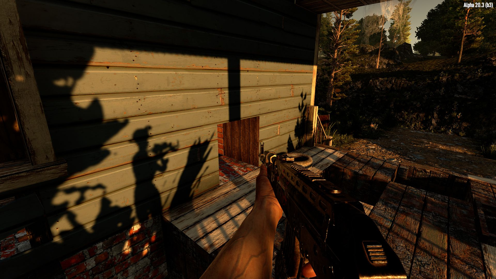

# OCB Better First Person View Modlet - 7 Days to Die (A21) Addon

Small Harmony Mod to enable true first person view camera in order
to get proper shadows on the hand model and equipped tools. Or did
you never ask yourself where the light on your pickaxe is coming
if you are mining underground during the day? Unfortunately this
also introduces a few visual glitches:

- Your hand and equipped tool will get distorted on higher FOVs
- Tools and hand may clip through walls if getting to close
- Still a few visual glitches with some equipped tools
- Lighting Glitch when torch is equipped and focus changes.
- Jars still get some light (shader uses global illumination?)
- Character shadow is only animated for some basic poses.

So is it worth it? It all depends on your personal style!
At FOV 50 (default is 65), the distortion is barely noticeable.
But having correct shadows on your hand greatly improves immersion.

## What does it do internally

Vanilla game uses two cameras to render first the main scene (player
camera), and then on top the FPV arm/hand (weapon camera). Since the
weapon camera doesn't render any other objects, there are no shadows
at all on the arm/hand and the equipped tool (what we try to fix).

To fix this we actually render the FPV arm/hand and tool in the player
camera view (by adjusting the culling mask of the cameras). This is
rather simple and already gives proper lighting on these FPV objects.
Unfortunately this means the arm/hand is now subject to FOV distortion.

There might be a way to tell the weapons camera to re-use the
player-cameras computed shadow-map, but no idea if thats possible!?

## Character body shadows

Unfortunately this was one of the hardest parts and is considered
quite experimental, as I had to hack quite a few corners to at least
get it to the state of where it is right now. Around 90% of the code
is in regard to that feature, so it is questionable if we should not
remove it altogether (and just have no character shadow in FPV).

Main character model is also enabled for main player camera and the
skinned mesh is set to render via `ShadowCastingMode.ShadowsOnly`.
This already introduces a static shadow for the model, but since the
animator is not running, the arms looks pretty unnatural. Also the
arm/hand (shoulders) of the FPV model create shadows that don't match
up with the rest of the body, so we disable those to not cast shadows.

With the animator enabled we get also an animated shadow. unfortunately
this also triggers the "hit a block" event twice, since we have two
animations running (the FPV arm/hands and the main player character).

I've patched this up in the hope I didn't miss any further edge-cases.
If so we probably will revert to a static shadow or no shadow at all.

## Changelog

### Version 0.4.1

- Fix issue when zooming into weapon scopes
- Fix issue with held item copy not being reset
- Improve layer settings to avoid self-shadowing

### Version 0.4.0

- Improvements for A21 compatibility
- Main issue seems fixed with A21.1

### Version 0.3.0

- Update compatibility for 7D2D A21.0(b313)

### Version 0.2.2

- Improve self-shadow of e.g. headlamp
- Fix light issue when holding torches

### Version 0.2.1

- Fix an issue with Undead Legacy

### Version 0.2.0

- Fix aiming with scopes

### Version 0.1.0

- Initial version

## Compatibility

I've developed and tested this Mod against version a20.3b3.

[1]: https://github.com/OCB7D2D/A20BepInExPreloader
